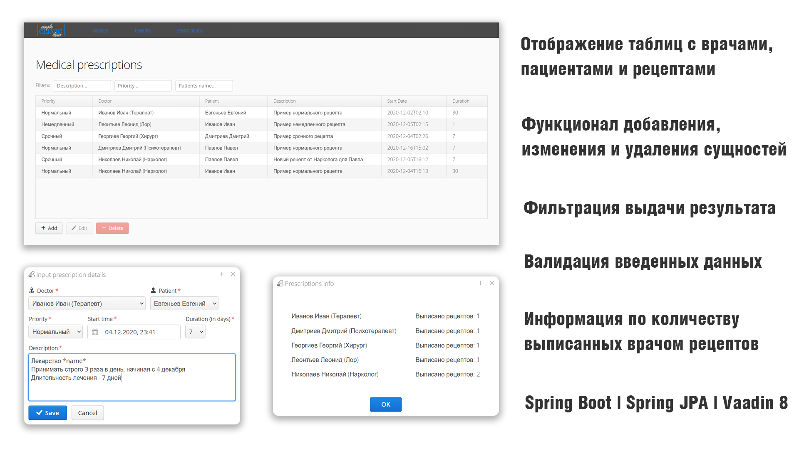

# SimpleClinicDemo
This is a test task that implements simple work of the clinic with doctors, patients and prescriptions.
Main stack: Java, Spring boot, JPA. Minor stack: Vaadin, HSQLDB

## Running the application from the command line.
To run from the command line, use `mvn spring-boot:run` and open http://localhost:8080 in your browser.
